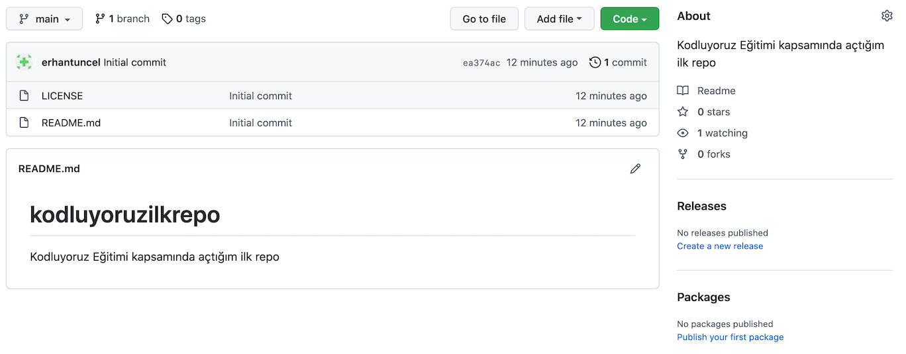

# Kodluyoruz İlk Repo

Bu repo [Kodluyoruz](https://www.kodluyoruz.org) Front-End Eğitiminde oluşturduğumuz ilk repo. İçerisinde bir ader README dosyası, bir adet de index.html barındırıyor.



## Installation

Öncelikle projeyi clonelayın. (https://github.com/erhantuncel/kodluyoruzilkrepo.git)

```
git clone https://github.com/erhantuncel/kodluyoruzilkrepo.git
```

## Usage

Projeyi cloneladıktan sonra Visual Studio Code programında açınız.

```
cd kodluyoruzilkrepo
code .
```

## Contributing

Pull requestler kabul edilir. Büyük değişiklikler için önce neyi değiştirmek istediğinizi tartışmak için bir konu açınız.

## License 

[MIT](https://choosealicense.com/licenses/mit/)

